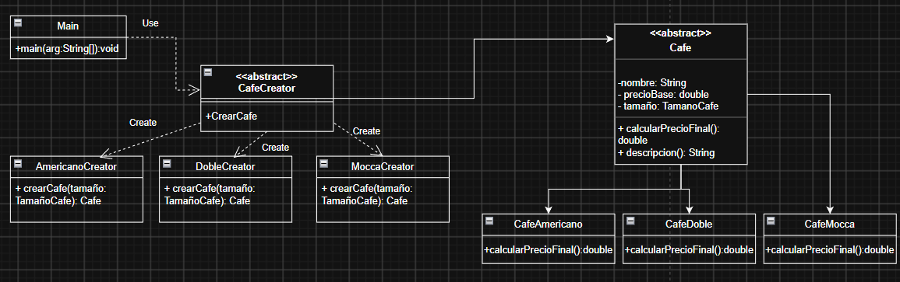

# Tienda Café en Línea

**Alumno:** Cardenas Julian Piero

##  Descripción

Este proyecto simula el sistema de ventas de una tienda de café en línea, aplicando el patrón de diseño **Factory Method** para la creación de distintos tipos de café.

El problema que resuelve es el siguiente: una cafetería necesita ofrecer varios tipos de café (Americano, Doble, Mocca), cada uno disponible en distintos tamaños (Pequeño, Mediano, Grande), donde el precio final varía según el tamaño elegido. En lugar de instanciar directamente cada tipo de café con `new`, se delega la creación a clases "Creator" especializadas (`AmericanoCreator`, `DobleCreator`, `MoccaCreator`), que heredan de una clase abstracta común (`CafeCreator`). De esta forma, el sistema queda abierto a agregar nuevos tipos de café sin modificar el código cliente (`Main`), respetando el principio de abierto/cerrado (Open/Closed) de SOLID.

El programa simula una venta: se arma un pedido con distintos cafés y tamaños, se calcula el precio final de cada uno (precio base + recargo por tamaño) y se genera un ticket con el detalle de cada ítem y el total a pagar.

## Diagrama de clases

